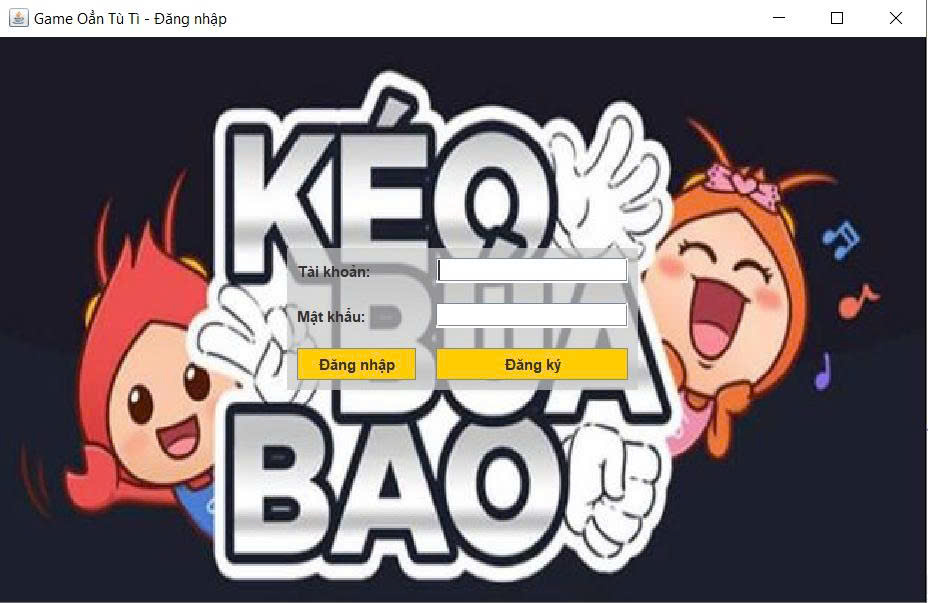
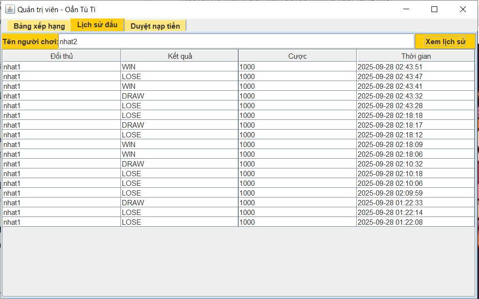
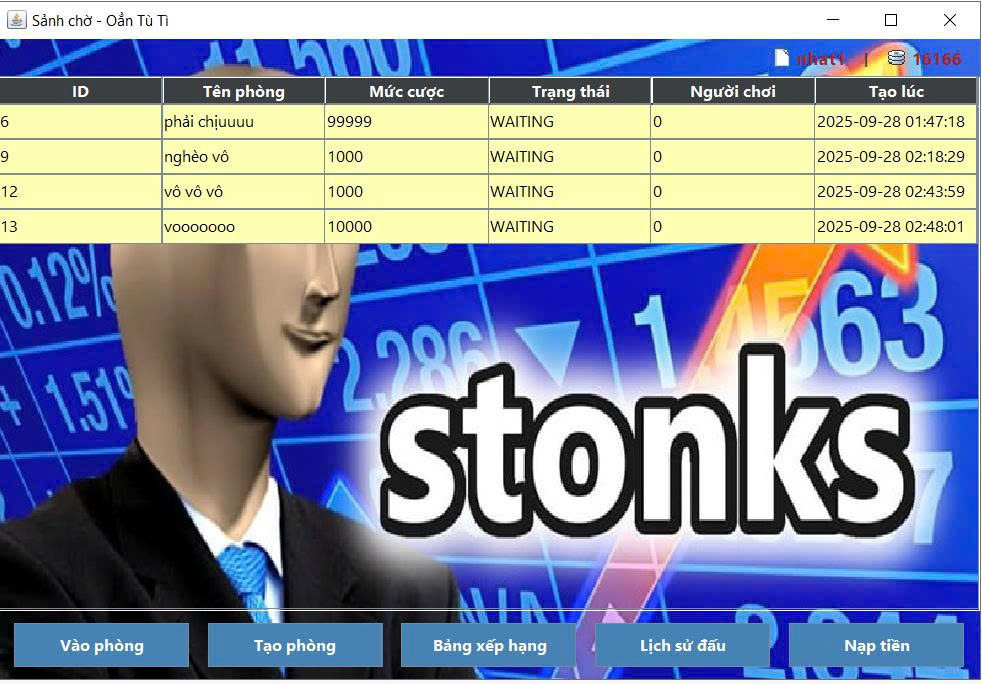
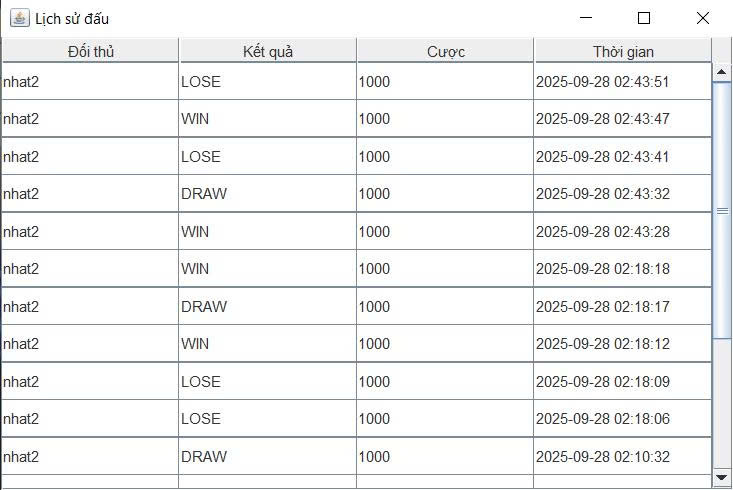
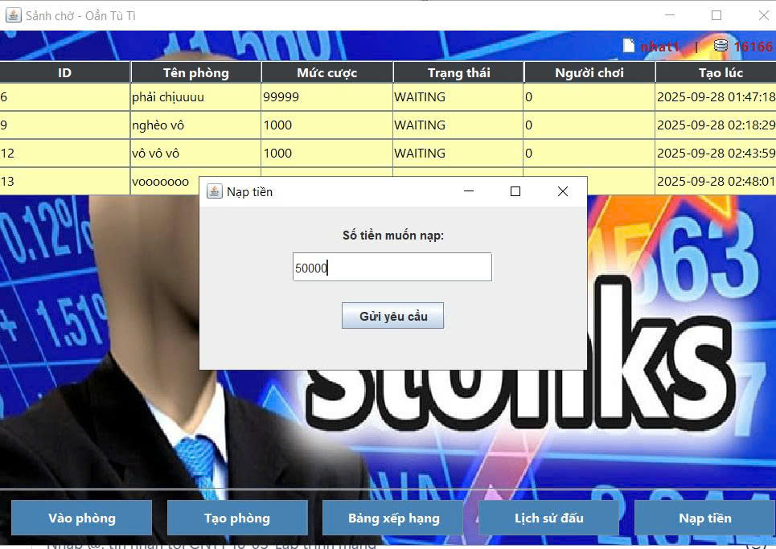
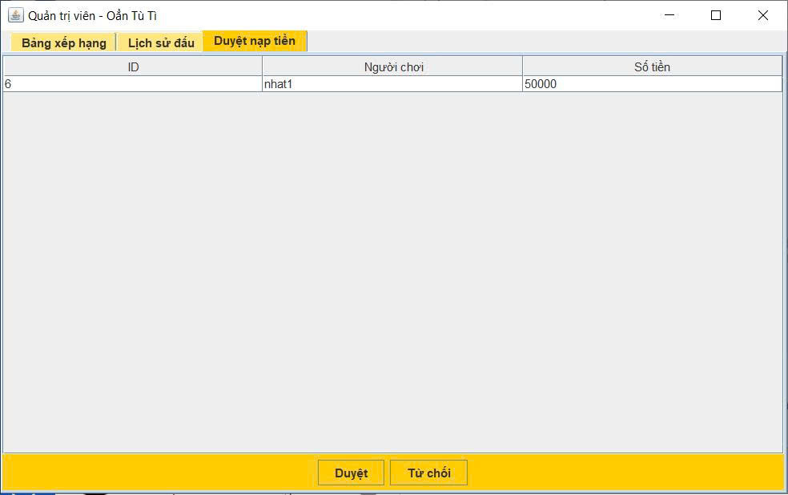
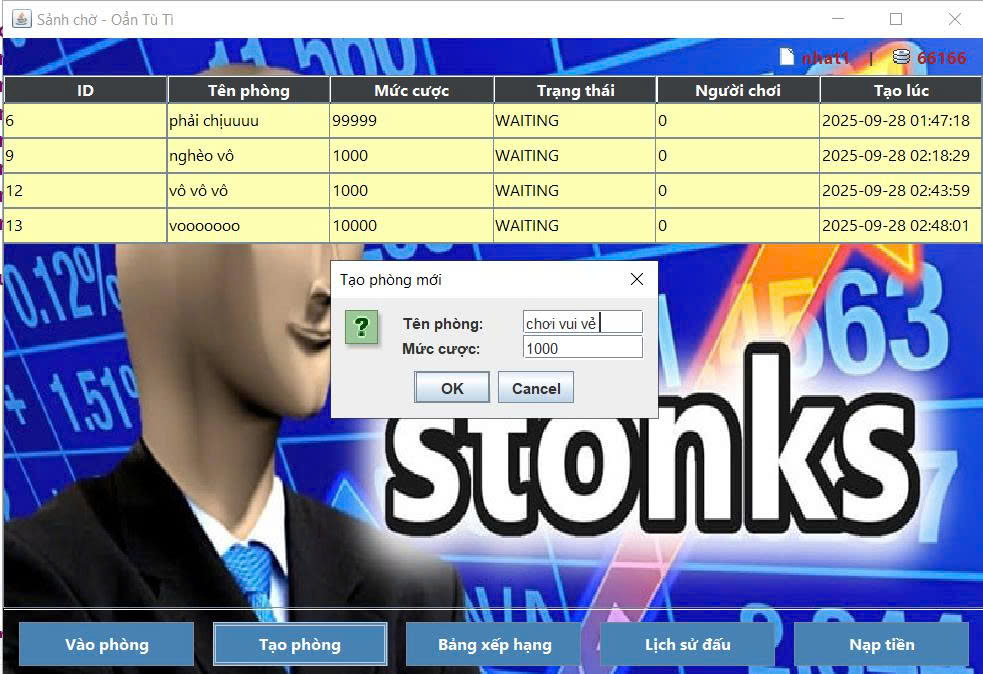
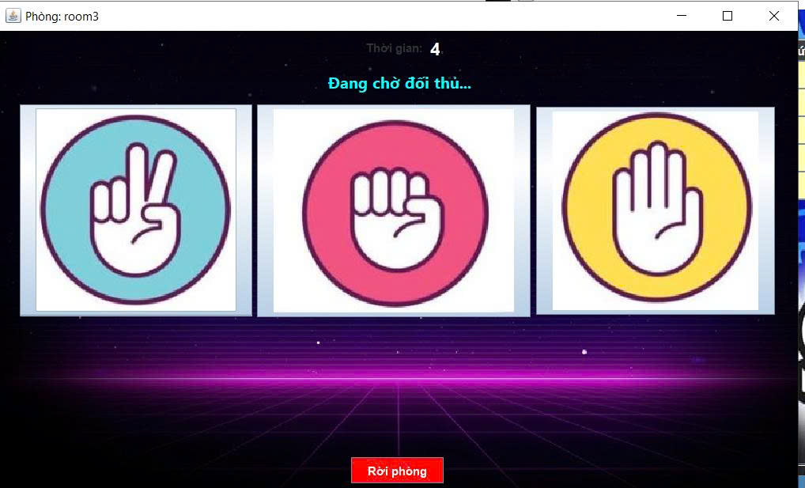

<h2 align="center">
    <a href="https://dainam.edu.vn/vi/khoa-cong-nghe-thong-tin">
    🎓 Faculty of Information Technology (DaiNam University)
    </a>
</h2>
<h2 align="center">
     TRÒ CHƠI OẲN TÙ TÌ QUA MẠNG(TCP)
</h2>

    

        
        
        
    

## 1. Giới thiệu hệ thống
   Hệ thống Trò chơi Oẳn Tù Tì qua mạng được xây dựng nhằm cung cấp một nền tảng giải trí đơn giản nhưng hấp dẫn, cho phép hai hoặc nhiều người chơi tham gia thi đấu với nhau hoặc người với máy thông qua kết nối mạng Internet.
Ứng dụng được phát triển bằng Java Swing để tạo giao diện đồ họa thân thiện, dễ sử dụng, đồng thời sử dụng giao thức TCP để truyền tải dữ liệu giữa Client và Server một cách ổn định và tin cậy.
Hệ thống được thiết kế theo mô hình Client–Server:
- Client: Chạy trên máy người chơi, hiển thị giao diện, gửi lựa chọn (Kéo – Búa – Bao) và nhận kết quả từ Server.
- Server: Quản lý kết nối, ghép cặp người chơi, xử lý luật chơi, tính toán kết quả và lưu trữ dữ liệu trận đấu vào File hoặc Cơ sở dữ liệu (SQLite/MySQL).
Đặc điểm nổi bật:
- Chơi trực tuyến: Người chơi có thể kết nối từ nhiều máy khác nhau qua mạng LAN hoặc Internet.
- Giao diện trực quan: Sử dụng Java Swing với các form đăng nhập, sảnh chờ, phòng chơi.
- Truyền dữ liệu dạng đối tượng: Sử dụng cơ chế tuần tự hóa (Serialization) của Java để gửi/nhận các đối tượng như thông tin người chơi, kết quả trận đấu.
- Lưu trữ lịch sử: Server lưu lại thông tin các trận đấu để phục vụ thống kê hoặc tra cứu.
- Bảo đảm tính toàn vẹn dữ liệu: Giao thức TCP đảm bảo dữ liệu được truyền đầy đủ, đúng thứ tự.
Mục tiêu của hệ thống:
- Mang lại trải nghiệm giải trí nhanh gọn, dễ tiếp cận.
- Minh họa việc kết hợp lập trình giao diện Java Swing với lập trình mạng và xử lý dữ liệu.
- Tạo nền tảng để mở rộng thành các trò chơi mạng khác trong tương lai

## 2.Ngôn ngữ & Công nghệ chính

## 3. Hình ảnh các giao diễn

  

  <em>Hình 1: Giao diện Đăng nhập/Đăng ký   </em>

  

  <em>Hình 2: Giao diện Admin   </em>

  

  <em>Hình 3: giao diện sảnh chờ   </em>

  

  <em>Hình 4: Giao diện lịch sử đấu cá nhân   </em>

  

  <em>Hình 5: Giao diện bảng xếp hạng   </em>

  

  <em>Hình 6: Giao diện yêu cầu Admin nạp tiền   </em>

  

  <em>Hình 7: Giao diện duyệt Nạp tiền của Admin   </em>

  

  <em>Hình 8: Giao dện Xem lịch sử đấu người chơi của Admin   </em>

  

  <em>Hình 9: Giao diện tạo phòng   </em>

  

  <em>Hình 10: Giao diện trận đấu   </em>

## 4. Hướng dẫn cài đặt và sử dụng
 **Java Development Kit (JDK)**: Phiên bản 8 trở lên
- **Hệ điều hành**: Windows, macOS, hoặc Linux
- **Môi trường phát triển**: IDE (IntelliJ IDEA, Eclipse, VS Code) hoặc terminal/command prompt

###  Cài đặt và triển khai
## Cài đặt
- **JDK (Java Development Kit)**  
  Bộ công cụ để biên dịch và chạy chương trình Java.  
  - [Oracle JDK](https://www.oracle.com/java/technologies/downloads/)  
  - [OpenJDK](https://openjdk.org/)  
  - [Adoptium Temurin](https://adoptium.net/)  

- **Eclipse IDE**  
  Môi trường lập trình Java phổ biến, hỗ trợ viết code, debug, quản lý project.  
  - [Eclipse Downloads](https://www.eclipse.org/downloads/)  

- **MySQL (Server & Workbench)**  
  Hệ quản trị cơ sở dữ liệu để lưu trữ thông tin người dùng, giao dịch,...  
  - [MySQL Installer (Windows)](https://dev.mysql.com/downloads/installer/)  
  - [MySQL Community Server](https://dev.mysql.com/downloads/mysql/)  
  - [MySQL Workbench](https://dev.mysql.com/downloads/workbench/) (công cụ trực quan để quản lý database)  

- **FlatLaf**  
  Thư viện giao diện giúp ứng dụng Java Swing có giao diện hiện đại, đẹp mắt.  
  - [FlatLaf Website](https://www.formdev.com/flatlaf/)  
  - [FlatLaf GitHub Releases](https://github.com/JFormDesigner/FlatLaf/releases)  

## Triển khai
- chạy MainServer sau khi hiện console chờ Client kết nối
- đăng nhập tài khoản admin (tk: admin/ mk: admin) để sử dụng chức năng quản trị viên
- chạy GameClient 2 lần để hiện 2 giao diện giả lập để chơi
- tài khoản có thể đăng ký theo mỗi cá nhân 
## Thông tin cá nhân
- **Họ tên**: Đậu Cao Minh Nhật.
- **Lớp**: CNTT 16-03.
- **Email**: daucaominhnhat@gmail.com.

© 2025 AIoTLab, Faculty of Information Technology, DaiNam University. All rights reserved.

---
